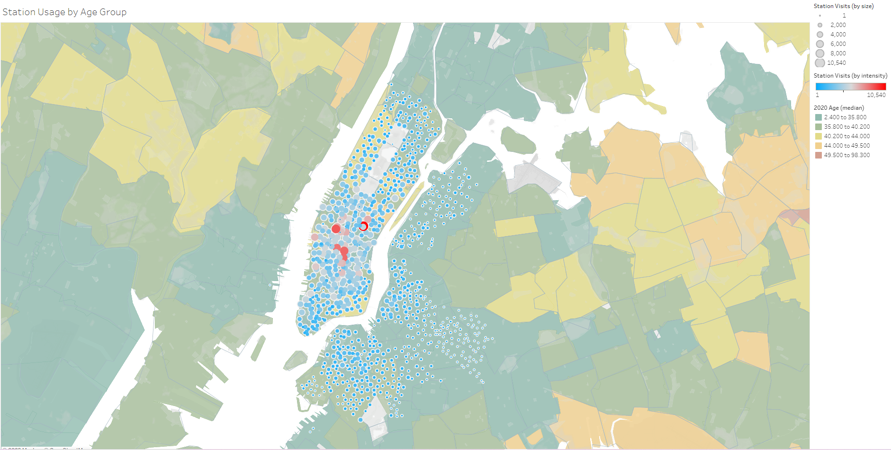
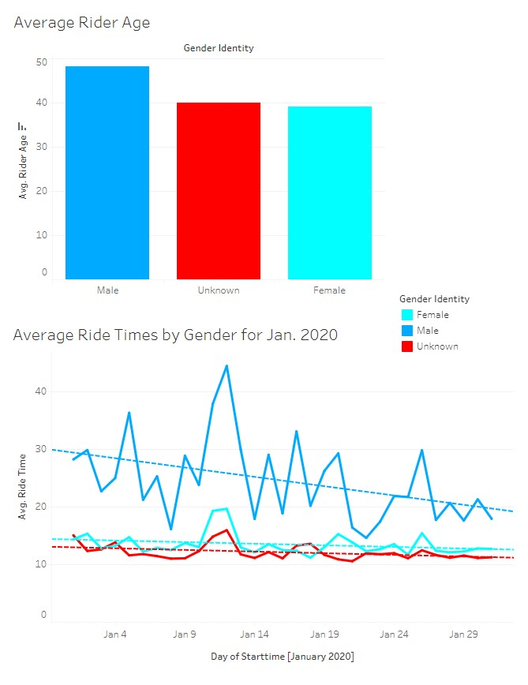
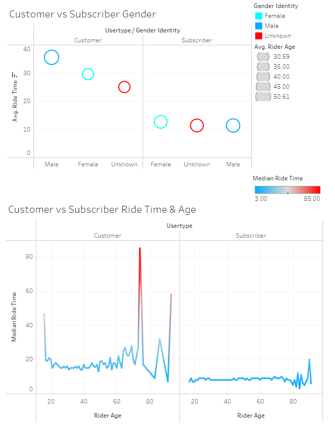
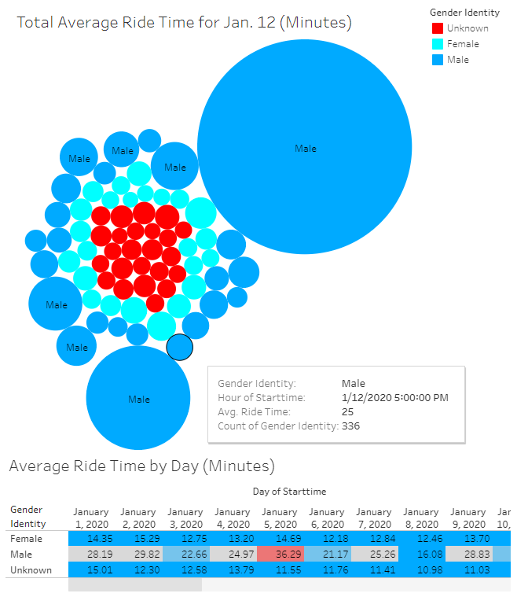

# Tableau Homework - Citi Bike Analytics
Included is the [link](https://public.tableau.com/app/profile/robert.salazar/viz/tableau-challenge_16521299158870/Story) to the tableau public doman housing the models.
- - -

Congratulations on your new job! As the new lead analyst for the [New York Citi Bike](https://en.wikipedia.org/wiki/Citi_Bike) Program, you are now responsible for overseeing the largest bike sharing program in the United States. In your new role, you will be expected to generate regular reports for city officials looking to publicize and improve the city program.

Since 2013, the Citi Bike Program has implemented a robust infrastructure for collecting data on the program's utilization. Through the team's efforts, each month bike data is collected, organized, and made public on the [Citi Bike Data](https://www.citibikenyc.com/system-data) webpage.

However, while the data has been regularly updated, the team has yet to implement a dashboard or sophisticated reporting process. City officials have a number of questions on the program, so your first task on the job is to build a set of data reports to provide the answers.

## Map

  

The map above shows clustering of stations by zip code and county. Further I added age groups by county to try to get as much insight as possible in one map.
This map was the base for all further models and analysis. 
- - -

## Age and Gender Demographics

  

From there I extrapolated further by creating an average age model for each gender represented in the data. Also, an average ride time graphed by each genders designated ride time for the month of January. While the trend line shows all observed genders to be at a decline it is safe to assume that female riders on average are riding more than males. This is shown in the model by the trendline sloping negative at a lesser intensity than that of the male rider. This shows that there has been some progress in Citybikes initiative to increase female ridership. 
- - -
## Customer vs Subscriber Demographics

  

More people riding bikes are regular customers while the other smaller quantity of riders belong to those who pay a subscription. Interestingly enough, the average ride times seemed to spike in the older ages. This could either be an error in the way the data is collected or simply just erroneous data. A closer look into how the collection of the data would give full insight into why it seems like most riders that ride longest are close to 80 years of age. Regardless of this, interesting insights can be made by observing these models.
- - -
## Intesting Day January 12, 2020

  

My final insight was to look deeper into the day that bikes were ridden the most. January 12th was a very peculiar day in this data set as this day saw the most riders by far compared to the rest of the month. While the 11th saw a similar increase in riders I can only assume that the fact that it was on a Saturday and Sunday are only part of the puzzle. Another reason for this could of been nicer weather than usual.

           
Final Thoughts

           
Since I only used a dataset for one month of the year this was as far as the inferences I was able to make. Had I used more data perhaps I would of been able to better understand how ridership is affected by other factors other than the weather. Also, from 2021 to current date the data has drastically changed and would like an identifying column to be added so both new and old data can be used together to make more meaningful reports.  

 

